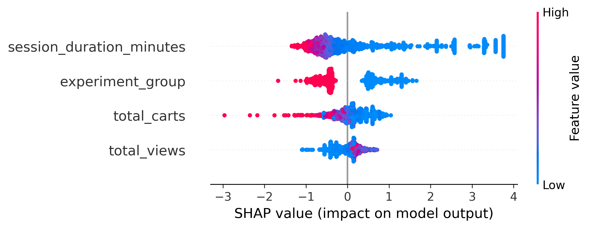
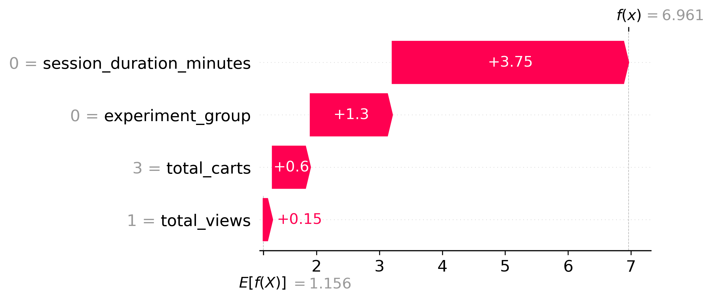

# E-Commerce Growth & Retention — The Checkout Experiment

An end-to-end data science project that answers two business questions on a real e-commerce
clickstream: **did a redesigned checkout flow actually lift revenue (causal)?** and **which
shoppers are about to abandon their cart (predictive)?**

It deliberately spans the full stack — **data engineering → analytics engineering → statistics →
machine learning → MLOps** — so it reads as one continuous pipeline rather than a single notebook.

> **Tech:** Python · SQL (BigQuery) · pandas · dbt · Google Cloud Storage · BigQuery · SciPy ·
> XGBoost · SHAP · FastAPI · Streamlit · Plotly · Docker · Evidently AI

---

## What it does

```
Raw clickstream (Kaggle, ~20M events / 4.6 GB)
        │  process_data.py  — chunked ingest, MD5 A/B bucketing, +5% treatment uplift
        ▼
GCS data lake  ──►  BigQuery  cosmetics_bronze         (Phase 1 · Data Engineering)
        │
        │  dbt  — medallion model + schema tests        (Phase 2 · Analytics Engineering)
        ▼
  cosmetics_silver (stg_events view)
  cosmetics_gold   (fact_user_sessions, dim_users)
        │
        ├── ab_test.py        — Chi-Square test of conversion lift   (Phase 3 · Statistics)
        ├── train_model.py    — XGBoost cart-abandonment classifier   (Phase 3 · ML)
        └── shap_analysis.py  — global + local SHAP explainability
        │
        ▼
FastAPI (/predict, /bulk_predict)  ◄──►  Streamlit 3-tab app   (Phase 4 · Deployment)
        │
        └── Evidently AI data-drift report             (Phase 4 · Observability)
```

### Highlights
- **Chunked ingestion** of 4.6 GB of events in 1M-row batches — memory stays flat regardless of file size.
- **Deterministic A/B bucketing** by hashing `user_id` (stable across all five months, like real experiment systems).
- **Sessionization in pure SQL** with window functions: `LAG()` + a 30-minute inactivity timeout + a cumulative-sum session ID.
- **dbt data contracts**: `not_null` and `accepted_values` tests fail the build instead of silently corrupting analysis.
- **Causal rigor**: a Chi-Square test of independence turns "conversion looks higher" into a defensible, p-value-backed claim.
- **Explainable ML**: every prediction ships with a SHAP waterfall plot, so each score is auditable feature-by-feature.

---

## Project structure

```
.
├── process_data.py            # Phase 1: chunked ingest + A/B simulation
├── ecommerce_dbt/             # Phase 2: dbt project (staging + marts, tests, docs)
│   └── models/
│       ├── staging/stg_events.sql
│       └── marts/{fact_user_sessions,dim_users}.sql
├── ab_test.py                 # Phase 3: Chi-Square A/B significance test
├── train_model.py             # Phase 3: XGBoost training -> models/xgb_model.pkl
├── shap_analysis.py           # Phase 3: SHAP summary + waterfall plots -> plots/
├── api/main.py                # Phase 4: FastAPI inference service (/predict, /bulk_predict)
├── app/main.py                # Phase 4: Streamlit app (predictor / live A/B dashboard / bulk scoring)
├── observability/drift_report.py   # Phase 4: Evidently AI data-drift report
├── docker-compose.yml         # orchestrates the API + Streamlit containers
├── models/                    # serialized model (170 KB) + training sample
└── plots/                     # generated SHAP visualizations
```

---

## Dataset

This project uses the Kaggle [**eCommerce Events History in a Cosmetics Shop**](https://www.kaggle.com/datasets/mkechinov/ecommerce-events-history-in-cosmetics-shop)
dataset (Oct 2019 – Feb 2020, ~20M events, ~4.6 GB).

The raw CSVs are **not committed** — they exceed GitHub's limits and are listed in `.gitignore`.
Download the five monthly CSVs from Kaggle and place them in a local `data/` directory before
running the pipeline.

---

## Running it

### Prerequisites
- Python 3.12, Docker (with Docker Compose)
- A Google Cloud project with BigQuery enabled, and `gcloud auth application-default login`
  (only needed for the BigQuery-backed steps: dbt, training, A/B test, and the live dashboard tab)

### The web app (FastAPI + Streamlit, via Docker)
```bash
gcloud auth application-default login        # for the live A/B dashboard tab
docker compose up --build
# Streamlit UI → http://localhost:8501   |   API docs → http://localhost:8000/docs
```

### The pipeline, step by step
```bash
pip install -r requirements.txt

python process_data.py            # 1. ingest + simulate the A/B experiment
# ... upload to GCS + load into BigQuery cosmetics_bronze ...
cd ecommerce_dbt && dbt build     # 2. build + test the Silver/Gold models
cd ..
python ab_test.py                 # 3a. Chi-Square test of the conversion lift
python train_model.py             # 3b. train XGBoost -> models/xgb_model.pkl
python shap_analysis.py           # 3c. generate SHAP plots -> plots/
python observability/drift_report.py   # 4. Evidently data-drift report
```

> **Note:** the BigQuery project ID is referenced in the SQL/Python. Swap
> `gen-lang-client-0874026413` for your own project to reproduce end-to-end.

---

## Results

The XGBoost classifier predicts cart abandonment from `total_views`, `total_carts`,
`session_duration_minutes`, and `experiment_group`, optimized for ROC-AUC.

| | |
|---|---|
| **A/B test (Chi-Square)** | _add your run's p-value / conversion lift_ |
| **Model ROC-AUC** | _add your held-out ROC-AUC_ |

SHAP global feature importance | SHAP local explanation (single prediction)
:---:|:---:
 | 

---

## Author

**Madhu Siddharth Suthagar** — Data Science & Analytics.
